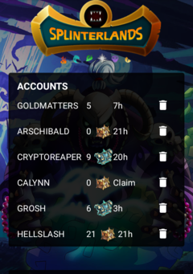
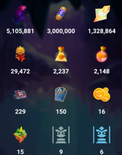
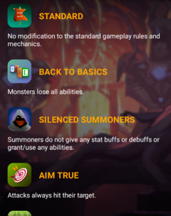
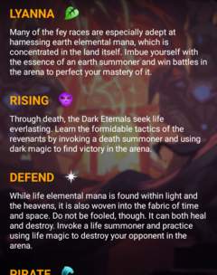
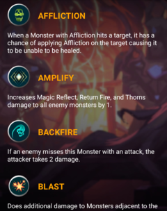

## Opensource Splinterlands Mobile App

Splinterlands is a card game powered by blockchain technology. It's mostly played in the web browser on the desktop but has also a mobile app. Yet the mobile app is basically a responsive version of the website and not a native app. I originally started the project as application to join the Splinterlands app team but the development is outsource and the team has stated that there is no native app planned in the future. I will keep developing it in my square time and eventually make DAO proposal to fund the open source client.

The **goal** of the project is to KISS (Keep it stupid simple) and **focus on performance and security**. The client doesn't have to support every single feature like renting and buying cards for example but **play and analyze battles**.

      

### The client can already

- List recent battles and some player details
- Show and filter card collection (without level and quantity info)
- List player token and asset balances
- Show recent chests rewards
- Is multi account compatible

### The client can't yet

- Play battles
- Animate/Analyze battles (currently links to website)
- Show guild infos
- Run on iOS

### Automatic screenshot

[ComposeScreenshots.kt](app/src/androidTest/java/com/splintergod/app/ComposeScreenshots.kt)

The copyright of the graphics in the demo project belongs to Splinterlands